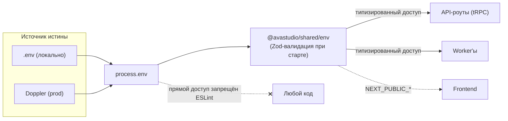
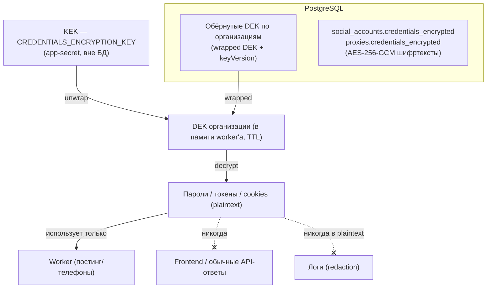

# Потоки секретов AVAStudio

Два изолированных контура секретов. Подробности и обоснование — в
[ADR-009](../decisions/ADR-009-secrets-architecture.md).

## Контур 1 — App-secrets (ключи приложения)

## Контур 2 — User-credentials (envelope encryption)

## Инвариант безопасности

- БД без KEK → только бесполезные шифртексты.
- KEK без БД → расшифровывать нечего.
- Утечка одного DEK → пострадает максимум одна организация.

## Кто что читает

| Компонент  | App-secrets            | Расшифровка user-credentials |
| ---------- | ---------------------- | ---------------------------- |
| Frontend   | только `NEXT_PUBLIC_*` | никогда                      |
| API (tRPC) | нужные                 | нет (только запись)          |
| Worker'ы   | нужные (scoped)        | да (единственное место)      |
| Логи       | redaction              | redaction                    |
